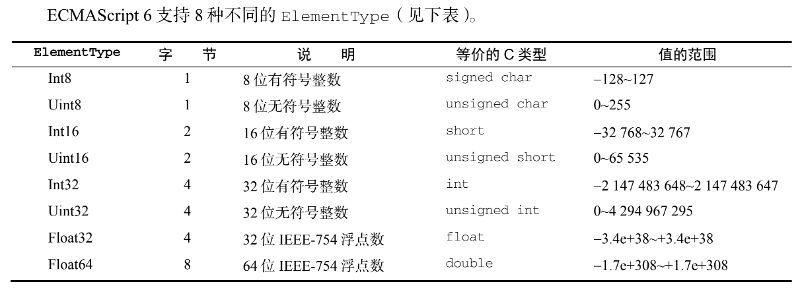

# 第6章集合引用类型

## Object


## Array

1. 静态方法
   1. Array.from
   2. Array.of
   3. Array.isArray
   1. 解决instanceO无法f检测多个全局上下文
   
2. 实例方法
   1. push/pop

   2. shift/unshift

   3. keys

   4. values

   5. entries

   6. copyWithin

      1. 按照指定范围浅复制数组中的部分内容，然后将它们插入到指定索引开始的位置。

      2. ```js
         const array = [0, 1, 2, 3, 4, 5, 6, 7, 8, 9];
         // 从array中复制索引0-3的元素插入到索引4开始的地方
         array.copyWithin(4, 0, 3); 
         console.log(array); // [0, 1, 2, 3, 0, 1, 2, 7, 8, 9] 
         
         // 支持负索引值，与 fill()相对于数组末尾计算正向索引的过程是一样的
         array.copyWithin(-4, -7, -3); 
         console.log(array); // [0, 1, 2, 3, 4, 5, 3, 4, 5, 6]
         ```

         

   7. fill

      1. ```javascript
         const zeroes = [0,0,0,0,0];
         zeroes.fill(5); 
         console.log(zeroe) // [5,5,5,5,5]
         zeroes.fill(0); // 重置
         
         // 用6填充索引大于等于3的元素
         zeroes.fill(6, 3);
         zeroes.fill(0);
         
         // 用 7 填充索引大于等于 1 且小于 3 的元素
         zeroes.fill(7, 1, 3); 
         console.log(zeroes); // [0, 7, 7, 0, 0]; 
         zeroes.fill(0); // 重置
         
         // 用 8 填充索引大于等于 1 且小于 4 的元素
         // (-4 + zeroes.length = 1) 
         // (-1 + zeroes.length = 4) 
         zeroes.fill(8, -4, -1); 
         console.log(zeroes); // [0, 8, 8, 8, 0];
         ```

   8. sort
      1. 比较函数接收两个参数，如果第一个参数应该排在第二个参数前面，就返回负值；如果两个参数相等，就返回 0；如果第一个参数应该排在第二个参数后面，就返回正值。
      2. 十大经典排序方式
         - [ ] 具体实现
   9. resverse
   
1. 翻转数组
   
10. cocat
   
    1. 在现有数组全部元素基础上创建一个新数组。它首先会创建一个当前数组的副本，然后再把它的参数添加到副本末尾，最后返回这个新构建的数组。如果传入一个或多个数组，则 concat()会把这些数组的每一项都添加到结果数组。如果参数不是数组，则直接把它们添加到结果数组末尾。
      
    2. 如果传入的是数组，默认只会展开第一层
      
       ```js
       const a = [1, 2]
       const b = [2,[3]]
       const c = a.concat(b);
       console.log(c); // [1,2,2,[3]]
       ```
    
   3. 阻止展开数组
      
      1. Symbol.isConcatSpreadable
      
         ```js
         const a = [1, 2]
         const b = [2, [3]]
         
         Object.defineProperty(b, Symbol.isConcatSpreadable, {
           value: false
         })
         
         console.log(a.concat(b)); // [1,2,[2,[3]]
         ```
       
    
5. slice

6. splice

7. indexOf/lastIndexOf/includes/find/findIndex

8. every/filter/forEach/some

9. reduce/reduceRight

## TypeArray

1. ArrayBuffer

   1. 是一个普通的 JavaScript 构造函数，可用于在内存中分配特定数量的字节空间。

      ```js
      const buf = new ArrayBuffer(16); // 在内存中分配 16 字节
      const buf2 = buf1.slice(4, 12);
      ```

   2. ArrayBuffer 在分配失败时会抛出错误
   3. 分配的内存不能超过 Number.MAX_SAFE_INTEGER字节
   4. 则会将所有二进制位初始化为 0
   5. 分配的堆内存可以被当成垃圾回收，不用手动释放
   6. 需要使用视图进行读取和写入

2. DataView

   1. 专为文件 I/O 和网络 I/O 设计，其API 支持对缓冲数据的高度控制，但相比于其他类型的视图性能也差一些。DataView 对缓冲内容没有任何预设，也不能迭代（没有读懂啥意思？）

   2. ElementType

      1. 

         ```js
         // 在内存中分配两个字节并声明一个 DataView 
         const buf = new ArrayBuffer(2); 
         const view = new DataView(buf);
         // 填充缓冲，让第一位和最后一位都是 1 
         view.setUint8(0, 0x80); // 设置最左边的位等于 1 
         view.setUint8(1, 0x01); // 设置最右边的位等于 1
         // 缓冲内容（为方便阅读，人为加了空格）
         // 0x8 0x0 0x0 0x1 
         // 1000 0000 0000 0001 
         // 按大端字节序读取 Uint16 
         // 0x80 是高字节，0x01 是低字节
         // 0x8001 = 2^15 + 2^0 = 32768 + 1 = 32769 
         alert(view.getUint16(0)); // 32769 
         // 按小端字节序读取 Uint16 
         // 0x01 是高字节，0x80 是低字节
         // 0x0180 = 2^8 + 2^7 = 256 + 128 = 384 
         alert(view.getUint16(0, true)); // 384 
         // 按大端字节序写入 Uint16 
         view.setUint16(0, 0x0004); 
         // 缓冲内容（为方便阅读，人为加了空格）
         // 0x0 0x0 0x0 0x4 
         // 0000 0000 0000 0100 
         alert(view.getUint8(0)); // 0 
         alert(view.getUint8(1)); // 4 
         // 按小端字节序写入 Uint16 
         view.setUint16(0, 0x0002, true); 
         // 缓冲内容（为方便阅读，人为加了空格）
         // 0x0 0x2 0x0 0x0 
         // 0000 0010 0000 0000 
         alert(view.getUint8(0)); // 2 
         alert(view.getUint8(1)); // 0
         ```

   3. 定型数组

      ```
      // 创建一个 12 字节的缓冲
      const buf = new ArrayBuffer(12); 
      // 创建一个引用该缓冲的 Int32Array 
      const ints = new Int32Array(buf); 
      // 这个定型数组知道自己的每个元素需要 4 字节
      // 因此长度为 3 
      alert(ints.length); // 3
      // 创建一个长度为 6 的 Int32Array 
      const ints2 = new Int32Array(6); 
      // 每个数值使用 4 字节，因此 ArrayBuffer 是 24 字节
      alert(ints2.length); // 6 
      // 类似 DataView，定型数组也有一个指向关联缓冲的引用
      alert(ints2.buffer.byteLength); // 24
      ```

      1. 可用方法：copyWithin/entries/every/fill/filter/find/findIndex/forEach/indexOf/join/keys/lstIndexOf/length/map/reudce/reudeRight/reverse/slice/some/sort/toLocaleString/toString/values

      2. 不可用方法：concat/pop/push/shift/spilce/unshift

      3. set

         1. 从提供的数组或定型数组中把值复制到当前定型数组中指定的索引位置

            ```js
            // 创建长度为8的int16数组
            const container = new Int16Array(8);
            // 给前4个值赋值
            container.set(Int8Array.of(1,2,3,5))
            console.log(container) // [1,2,3,4,0,0,0,0]
            ```

      4. subarray

         1. 于从原始定型数组中复制的值返回一个新定型数组。复制值时的开始索引和结束索引是可选的：

            ```js
            const source = Int16Array.of(2, 4, 6, 8); 
            // 把整个数组复制为一个同类型的新数组
            const fullCopy = source.subarray(); 
            console.log(fullCopy); // [2, 4, 6, 8] 
            // 从索引 2 开始复制数组
            const halfCopy = source.subarray(2); 
            console.log(halfCopy); // [6, 8] 
            // 从索引 1 开始复制到索引 3 
            const partialCopy = source.subarray(1, 3); 
            console.log(partialCopy); // [4, 6]
            ```

## Map

- 能使用任何值作为key
- 初始化

```js
const map = new Map();

// 使用数组键值对
const map2 = new Map([[key1: 'value1'], [key2: 'value2']]);

// 使用自定义迭代器初始化
comst map3 = new Map({
  [Symbol.iterator]: function*() { 
   yield ["key1", "val1"]; 
   yield ["key2", "val2"]; 
   yield ["key3", "val3"]; 
   }
})
```

- Object 类型的一个主要差异是，Map 实例会维护键值对的插入顺序，因此可以根据插入顺序执行迭代操作

- 选择 **Object** 还是 **Map**
  - 内存占用：不同浏览器的情况不同，但给定固定大小的内存，Map 大约可以比 Object 多存储 50%的键/值对
  - 插入性能：如果代码涉及大量插入操作，那么显然 Map 的性能更佳
  - 查找速度：如果代码涉及大量查找操作，那么某些情况下可能选择 Object 更好一些。
  - 删除性能：如果代码涉及大量删除操作，那么毫无疑问应该选择 Map。

## WeakMap

- 弱映射中的键只能是 Object 或者继承自 Object 的类型，尝试使用非对象设置键会抛出TypeError。值的类型没有限制。

  ```js
  const wm = new WeakMap(); 
  wm.set({}, "val");
  
  ```

  

  